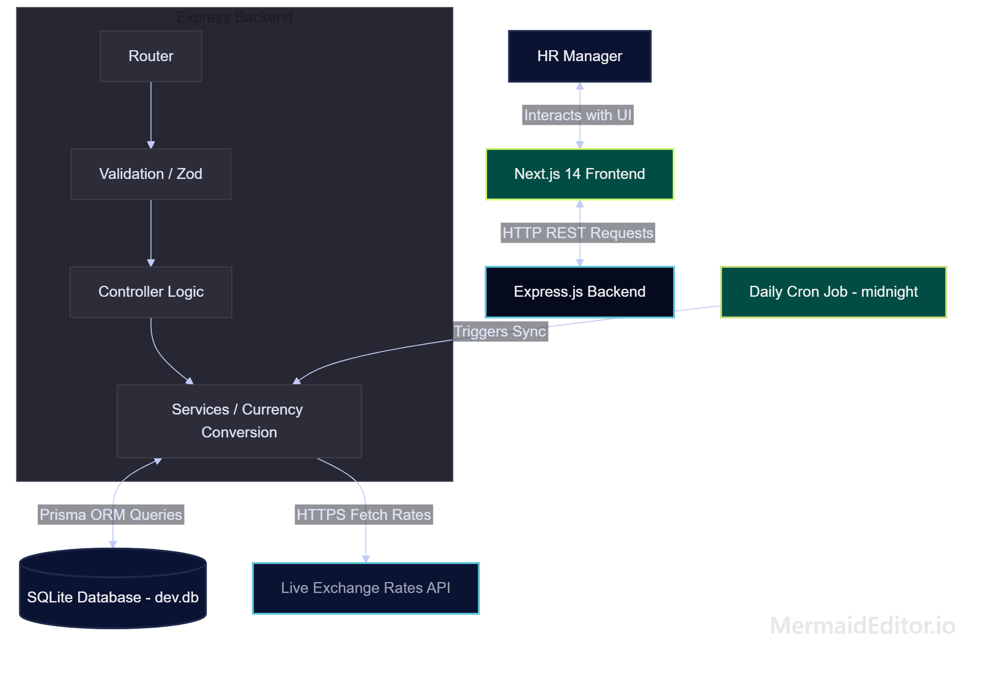

# ACME Salary Management System

A web-based Employee Salary Management System designed for ACME Corp's HR Manager, built following a strict design system inspired by **Incubyte (incubyte.co)**.

## System Architecture

## Project Structure

This project is a mono-repo containing two separate applications:
- **`backend/`**: Express.js + TypeScript + SQLite + Prisma ORM. Serves REST APIs and aggregates analytics.
- **`frontend/`**: Next.js 14 (App Router) + Tailwind CSS + shadcn/ui + Recharts.

---

## Getting Started

Detailed instructions for running, seeding, and testing both applications will be populated here as development progresses.

For full product framing and specifications, see:
- [Requirements Document](requirements.md)
- [Design System Specification](design_system.md)
- [Architecture Details](ARCHITECTURE.md)

